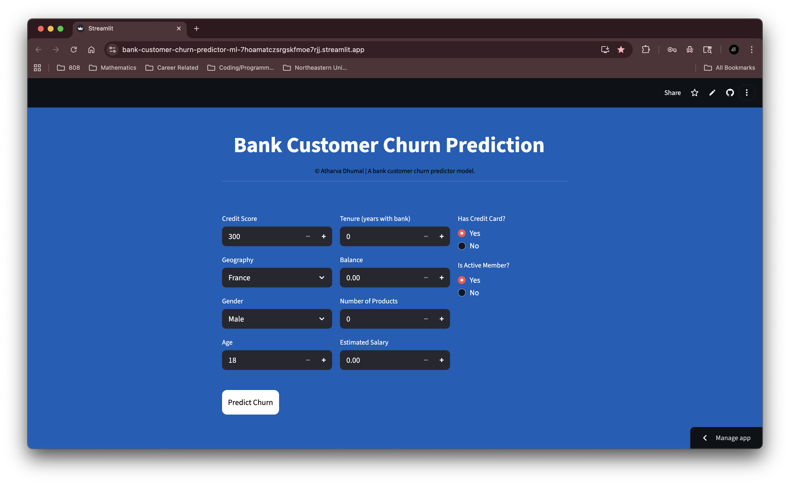
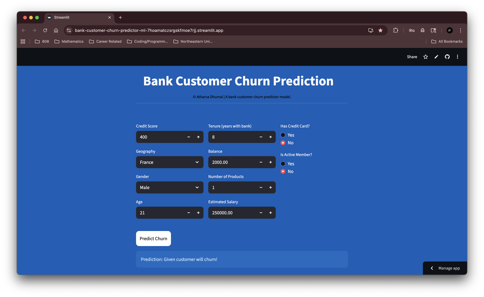

# Bank Churn Prediction Machine Learning Model

## 📊 Project Overview
### Introduction
This project builds a machine learning system to predict customer churn for a retail bank. The goal is to analyze customer demographic and account-related features to identify which customers are most likely to leave the bank. The solution includes data preprocessing, handling class imbalance, hyperparameter tuning, model comparison and deployment with an interactive interface.

### Objectives
- Predict customer churn accurately using machine learning models.
- Handle class imbalance effectively to avoid biased predictions.
- Build a scalable preprocessing pipeline with encoding, scaling and resampling steps.
- Compare multiple models (Logistic Regression, Random Forest, XGBoost) to select the best performing one.
- Deploy a Streamlit-based app allowing bank staff to predict churn risk for new/existing customers.

## 📈 Results Summary
Threshold 0.35 (Optimized):

- Successfully catches 70% of churners (recall) vs. only 53% with default.
- Trade-off: More false alarms (precision drops from 62% to 51%).
- Overall F1 score improves marginally: 0.57 → 0.59.
- Accuracy decreases slightly: 84% → 81%.

Key Finding: Lowering the threshold to 0.35 identifies 17% more churners (68 additional customers), which is valuable for retention campaigns despite increased false positives. The business impact depends on whether the cost of contacting non-churners outweighs the benefit of preventing additional churn

## 🌐 Deployment
The application is deployed on Streamlit Cloud and can be accessed at:
- **Live App:** https://bank-customer-churn-predictor-ml-7hoamatczsrgskfmoe7rjj.streamlit.app/
- **Status:** 🟢 Active

#### How to Use:
1. Enter customer details
2. Click Predict
3. Instantly view whether the customer is likely to churn or stay.

## 🖼️ Screenshots
### Web Application Interface

*Clean and intuitive user interface for churn analysis*

### Prediction Examples

*Churn Prediction*

*No Churn Prediction*

## ⚙️ Methodology
### Data Preprocessing Pipeline
- One-hot encoding for categorical features (Geography, Gender).
- Scaling of numeric features (CreditScore, Age, Balance, Salary, etc.).
- Handled class imbalance using SMOTE inside an imbalanced-learn pipeline.
- Train-test split with stratification to preserve churn ratio.

### Model Training & Tuning
- Models used: Logistic Regression, Random Forest, XGBoost.
- Hyperparameter tuning via GridSearchCV with cross-validation.
- Model comparison using the (tuned parameters from GridSearchCV) to find optimal model.
- Evaluation metrics: Accuracy, Precision, Recall, F1, ROC-AUC.
- Final comparison showed Random Forest as best candidate.

### Deployment Architecture
- Built preprocessing Pipeline: [Encoding → Scaling].
- Built an Imbalanced Pipeline: [SMOTE → Preprocessing → Model].
- Developed input utility function to transform raw input data into model-compatible format.
- Serialized final model and preprocessing steps with pickle.
- Deployed with Streamlit app for real-time churn prediction.

### 🛠️ Technologies Used
1.	Python 3.x – Core programming language
2.	Pandas & NumPy – Data manipulation and preprocessing
3.	Scikit-learn – ML models, pipelines, hyperparameter tuning
4.	Imbalanced-learn – Resampling with SMOTE
5.	XGBoost – Gradient boosting classifier
6.	Streamlit – Web app deployment
7.	Matplotlib & Seaborn – Data visualization
8.	Pickle – Model serialization
